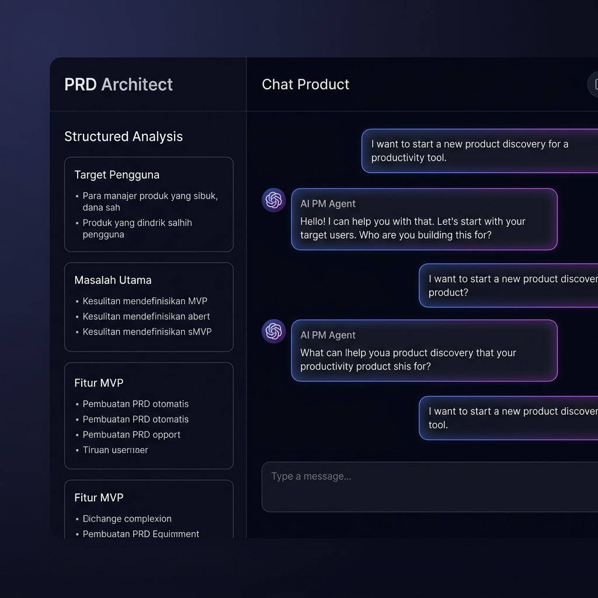

# PRD Architect — AI-Powered Product Discovery

> Ubah ide kasar aplikasi Anda menjadi spesifikasi produk yang siap dikembangkan, dalam hitungan menit.

PRD Architect adalah chat interface berbasis AI yang memandu Anda merumuskan ide produk digital secara terstruktur — mengidentifikasi target pengguna, masalah utama, dan fitur MVP — melalui percakapan interaktif dengan AI Product Manager.



## ✨ Fitur

- 💬 **Conversational Discovery** — AI mengajukan pertanyaan tajam untuk menggali ide Anda
- 📊 **Live Analysis Dashboard** — Sidebar terupdate otomatis dengan insight terstruktur
- 🔄 **Multi-Model Support** — Pilih model AI gratis via OpenRouter
- ⛔ **Stop Generation** — Batalkan respons AI kapan saja
- 📥 **Export Specs** — Download spesifikasi hasil analisis dalam format JSON
- 🔒 **Server-side API Proxy** — API key tidak pernah terekspos ke browser

## 🚀 Quick Start

### Prerequisites
- Node.js 18+
- OpenRouter API Key (gratis di [openrouter.ai/keys](https://openrouter.ai/keys))

### Installation

```bash
# Clone repository
git clone https://github.com/your-username/prd-architect.git
cd prd-architect

# Install dependencies
npm install

# Setup environment
cp .env.local.example .env.local
# Edit .env.local dan masukkan OPENROUTER_API_KEY Anda

# Jalankan development server
npm run dev
```

Buka [http://localhost:3000](http://localhost:3000) di browser.

## ⚙️ Environment Variables

Buat file `.env.local` dari template:

```bash
cp .env.local.example .env.local
```

| Variable | Required | Description |
|:---------|:---------|:------------|
| `OPENROUTER_API_KEY` | ✅ Yes | API key dari [openrouter.ai](https://openrouter.ai/keys) |

## 🛠️ Tech Stack

| Layer | Technology |
|:------|:-----------|
| Framework | Next.js 16 (App Router) |
| Language | TypeScript |
| Styling | Tailwind CSS v4 |
| AI Provider | OpenRouter (multi-model) |
| Validation | Zod |
| Runtime | Node.js |

## 🔒 Security

- API key disimpan server-side via environment variable, tidak pernah dikirim ke browser
- Input validation menggunakan Zod schema di API route
- Rate limiting: 15 requests/menit per IP
- CSRF protection di production
- Security headers (CSP, HSTS, X-Frame-Options) aktif di production
- Server-side model whitelist mencegah penggunaan model arbitrary

## 📁 Project Structure

```
src/
├── app/
│   ├── api/chat/route.ts    # API proxy ke OpenRouter
│   ├── page.tsx             # Main chat interface
│   ├── layout.tsx           # Root layout
│   └── globals.css          # Global styles
├── config/
│   └── prompts.ts           # System prompt AI
└── lib/
    └── rateLimit.ts         # In-memory rate limiter
```

## 📄 License

MIT
